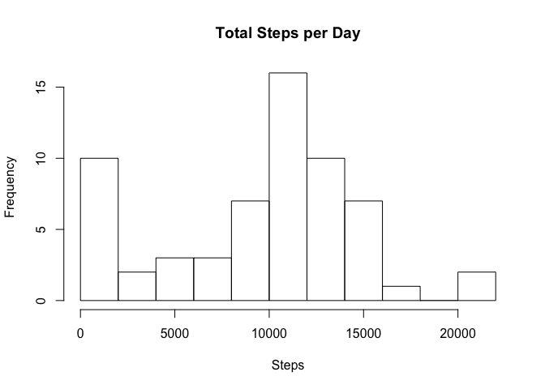
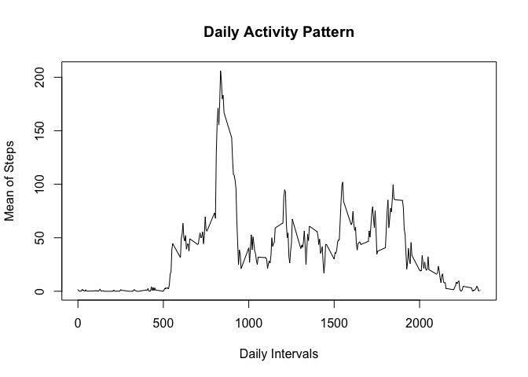
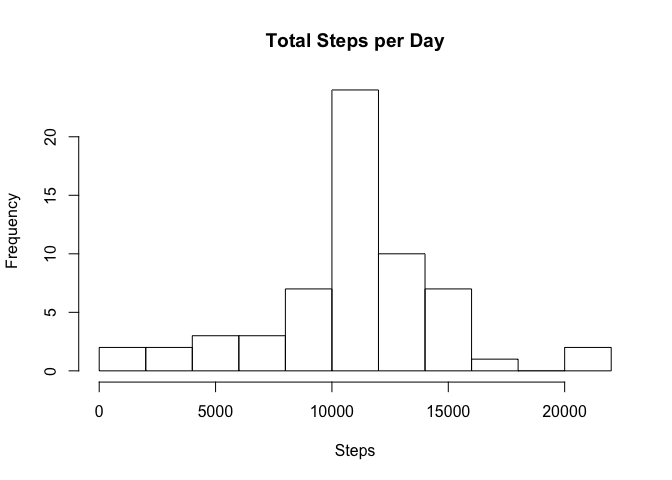

# Reproducible Research: Peer Assessment 1


## Introduction
It is now possible to collect a large amount of data about personal movement using activity monitoring devices such as a Fitbit, Nike Fuelband, or Jawbone Up. These type of devices are part of the "quantified self" movement -- a group of enthusiasts who take measurements about themselves regularly to improve their health, to find patterns in their behavior, or because they are tech geeks. But these data remain under-utilized both because the raw data are hard to obtain and there is a lack of statistical methods and software for processing and interpreting the data.

This assignment makes use of data from a personal activity monitoring device. This device collects data at 5 minute intervals through out the day. The data consists of two months of data from an anonymous individual collected during the months of October and November, 2012 and include the number of steps taken in 5 minute intervals each day.  

## Data
The data for this assignment can be downloaded from this web site:
[Activity monitoring data](https://d396qusza40orc.cloudfront.net/repdata%2Fdata%2Factivity.zip) (52K).
The variables included in this dataset are:

- steps: Number of steps taking in a 5-minute interval (missing values are coded as ????????)
- date: The date on which the measurement was taken in YYYY-MM-DD format
- interval: Identifier for the 5-minute interval in which measurement was taken  

The dataset is stored in a comma-separated-value (CSV) file and there are a total of 17,568 observations in this dataset.


## Loading and preprocessing the data
Be sure to set the working directory to the location where your file is stored before loading the data. 

```r
# Read data from file
activity <- read.csv(unz("activity.zip", "activity.csv"), header = TRUE, sep = ",")
# Convert date format
activity$date = as.Date(as.character(activity$date), "%Y-%m-%d")
```


## What is mean total number of steps taken per day?
To calculate the total number of steps per day, I use the tapply() function to break up the data into groups for each day and apply the function mean() to each of the groups.

```r
# Apply the sum() function to the days 
sum_steps <- tapply(activity$steps, activity$date, sum, na.rm = T) 
# Plot a histogram
hist(sum_steps, xlab = "Steps", main = "Total Steps per Day", breaks = 10)
```

 

```r
# Apply the mean() function and the median() function to the total number of steps calculate above
mean(sum_steps)
```

```
## [1] 9354.23
```

```r
median(sum_steps)
```

```
## [1] 10395
```
  

## What is the average daily activity pattern?
This time I use the aggregate() function to solve the problem.

```r
# Apply the mean() function to daily intervals 
interval_steps <- aggregate(activity$steps, by = list(activity$interval), FUN = mean, na.rm = T) 
# Plot the time series
plot(x = interval_steps[,1], y = interval_steps[,2], type = "l", xlab = "Daily Intervals", ylab = "Mean of Steps", main = "Daily Activity Pattern")
```

 

The second question of this paragraph is a simple query of the max value of steps.

```r
# Use the max() function to evaluate the interval with the maximum number of steps 
interval_steps[which.max(interval_steps[,2]),1]
```

```
## [1] 835
```

## Imputing missing values
To get rid of missing values, I first calculate the total number of missing values in the dataset.

```r
NAs <- sum(apply(is.na(activity), 1, any))
```
The total number of missing values in the data is 2304.  

Next, I use a function to replace the NAs with the mean of averaged intervals calculated above.

```r
# Create a function  to replace  missing values with the mean value of its 5-minute interval
NA.replace <- function(steps, interval) {
    value <- NA
    if (is.na(steps)) 
        value <- interval_steps[interval_steps[, 1] == interval , 2]
    else
        value <- steps
    return(value)
}
```

I use this function to manipulate the data in a new dataset.

```r
activity2 <- activity
activity2$steps <- mapply(NA.replace, activity2$steps, activity2$interval)
NAs_now <- sum(apply(is.na(activity2), 1, any))
```
The total number of missing values in the data is now 0.  

At last I plot a histogram of the total number of steps taken each day and calculate the mean and median total number of steps taken per day. 

```r
# Apply the sum() function to the days 
sum_steps2 <- tapply(activity2$steps, activity2$date, sum) 
# Plot a histogram
hist(sum_steps2, xlab = "Steps", main = "Total Steps per Day", breaks = 10)
```

 

```r
# Apply the mean() function and the median() function to the total number of steps calculate above
mean(sum_steps2)
```

```
## [1] 10766.19
```

```r
median(sum_steps2)
```

```
## [1] 10766.19
```
The new mean of total number steps per day and the new median of total number steps per day differ from the original mean and median of the first part of the assignment, they are slightly higher than before.


## Are there differences in activity patterns between weekdays and weekends?
Now I create a new factor variable in the dataset with two levels ??? ???weekday??? and ???weekend??? indicating whether a given date is a weekday or weekend day.

```r
# Create a function to decide if a given date is a weekday or weekend
weekday.weekend <- function(date) {
    value <- NA
    if (weekdays(date) %in% c("Sunday", "Saturday")) 
        value <- "weekend"
    else
        value <- "weekday"
    return(value)
}
```

I use this function to create a new factor variable in the new dataset.

```r
activity2$day <- mapply(weekday.weekend, activity2$date)
```

Finally I make a panel plot containing a time series plot of the 5-minute interval (x-axis) and the average number of steps taken, averaged across all weekday days or weekend days (y-axis).

```r
# Apply the mean() function to daily intervals
interval_steps <- aggregate(activity2$steps, by = list(activity2$interval, activity2$day), FUN = mean)
# Plot the time series panels
library(lattice)
xyplot(x ~ Group.1 | Group.2, data = interval_steps, type = "l", layout = c(1, 2), xlab = "Interval", ylab = "Number of Steps")
```

 


